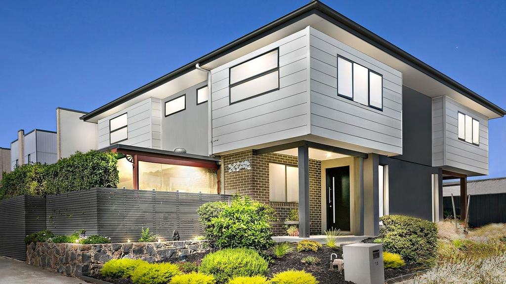

# Udacity Blockchain Capstone

The capstone will build upon the knowledge you have gained in the course in order to build a decentralized housing product.

## Welcome!
This project create a decentralized house listing service.

At present, property titles are often paper-based, creating opportunities for errors and fraud. Title professionals find defects in 25% of all titles during the transaction process, according to the American Land Title Association.

Any identified defect makes it illegal to transfer a property title to a buyer until it is rectified. This means property owners often incur high legal fees to ensure authenticity and accuracy of their property titles.

Moreover, title fraud poses a risk to homeowners worldwide. US losses associated with title fraud reportedly averaged around $103,000 per case in 2015, compelling many property buyers to purchase title insurance.

These title management issues could potentially be mitigated by using blockchain technology to build immutable digital records of land titles and using blockchain for transparent transactions. This approach could simplify property title management, making it more transparent and helping to reduce the risk of title fraud and the need for additional insurance.

Some companies and governments around the globe have already implemented blockchain technology for the title management process.

Ghanaian blockchain company Bitland has been working on a solution for Ghana, where it is estimated that almost 80% of land is unregistered, according to Forbes. Those that possess unregistered land find it more difficult to prove legal ownership, increasing their exposure to the risk of land seizures or property theft.

Bitland is seeking to create secure digital public records of ownership on its blockchain platform, with the aim of protecting land owners from title fraud. Bitland has expanded to operate in 7 African nations, India, and is also working with Native Americans in the US.

In this project you will be minting your own tokens to represent your title to the properties. Before you mint a token, you need to verify you own the property. You will use zk-SNARKs to create a verification system which can prove you have title to the property without revealing that specific information on the property. We covered the basics on zk-SNARKs in Privacy lesson in Course 5

Once the token has been verified you will place it on a blockchain market place (OpenSea) for others to purchase. Let's get started!

## Install

1.  To install, download or clone the dependecies, run:

    `npm install`

2. In separate window start Ganache in the terminal with 50 account addresses of 100 Ether each.

   `ganache-cli -m "<Enter the Metamask Seed>" -a 50`

3. In the directory eth-contracts/ compile smart contracts with truffle:

   `truffle compile`

   This will create the smart contract artifacts in folder build/contracts.

4. Then compile and deploy with truffle on the local/public network.
   - Rinkeby Public network

        `truffle migrate --network rinkeby`

   - localhost network

        `truffle migrate --network development --reset --compile-all`

        - Network Ports
                  - 7545 for ganache-GUI
                  - 8545 for ganache-cli
                  - 9545 for truffle-test
## Testing
To run truffle tests from inside the directory eth-contracts/:

`truffle test`

## Create ZK-Snarks Proof using [Zokrates](https://github.com/Zokrates/ZoKrates)
Succinct Zero-Knowledge proofs (zkSnarks) are proving to be one of the most promising frameworks for enhancing privacy and scalability in the blockchain space.

Projects like Zcash are using zkSnarks to make payments anonymous (rather than pseudonymous). Other projects such as Coda are experimenting with trustless light clients by using recursive zkSnarks to dramatically reduce the number of state verifications blockchain clients have to perform when coming online. Ethereum founder, [Vitalik Buterin wrote how zkSnarks can be used to scale transaction speed on Ethereum](https://ethresear.ch/t/on-chain-scaling-to-potentially-500-tx-sec-through-mass-tx-validation/3477)

### Setting up ZoKrates
Follow the below commands step by step for generating verification.sol and proof.json files which will be needed to verify the contract without exposing the actual information.

1.  `Install [Docker](https://docs.docker.com/get-docker/)``
2. `docker run -v /path/to/zokrates/zokrates/code:/home/zokrates/code -ti zokrates/zokrates /bin/bash`
3.  `cd code/square`
4.  `~/zokrates compile -i square.code`
5.  `~/zokrates setup`
6.  `~/zokrates compute-witness -a 3 9`
7.  `~/zokrates generate-proof`
8.  `~/zokrates export-verifier`

## Minting a Token
In a separate terminal window, launch the DApp:

npm run dev

To view dapp

`http://localhost:3000`

## Marketplace
Front end is created in OpenSea marketplace to sell or purchase the tokens
https://rinkeby.opensea.io/get-listed/step-two

# Project Notes and Links
contract address(SolnSquareVerifier):    

contract address(SquareVerifier):       

The contract ABIs are located in the corresponding .json files under the folder build/contracts

# Project Resources

* [Remix - Solidity IDE](https://remix.ethereum.org/)
* [Visual Studio Code](https://code.visualstudio.com/)
* [Truffle Framework](https://truffleframework.com/)
* [Ganache - One Click Blockchain](https://truffleframework.com/ganache)
* [Open Zeppelin ](https://openzeppelin.org/)
* [Interactive zero knowledge 3-colorability demonstration](http://web.mit.edu/~ezyang/Public/graph/svg.html)
* [Docker](https://docs.docker.com/install/)
* [ZoKrates](https://github.com/Zokrates/ZoKrates)
